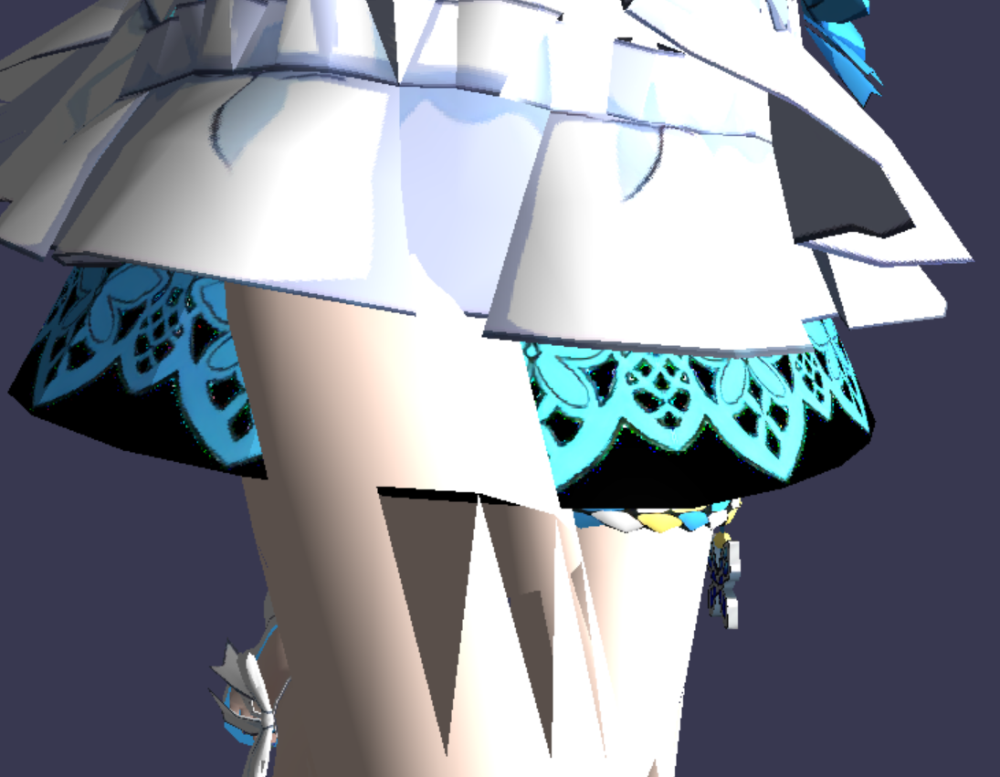

# Introduction

VinHRenderer is a simple software renderer, which is also one of my homework. **It has some known bugs so don't use this for learning for now**.

# Get Started

## Build

```bash
$ cd VinHRenderer
$ cmake .
$ cd bin
$ VinHRenderer.exe xxx.txt
```

## Usage

You should write a script to tell the renderer where to find the models and textures. An example may be like this:

```bash
# mmd: 1   whether the model is a mmd-format file, default to 1(yes)
camera: 0/1/3 0/1/0 0/1/0              # the initial position of the camera
model: ../obj/xier/xierarm.obj         # the path of the model file
diff: ../obj/xier/xierarm_diffuse.tga  # the path of the corresponding texture file
model: ../obj/xier/xierbody.obj        # a model must be followed by a texture file
diff: ../obj/xier/xierbody_diffuse.tga
model: ../obj/xier/xiercloth.obj
diff: ../obj/xier/xiercloth_diffuse.tga
model: ../obj/xier/xierface.obj
diff: ../obj/xier/xierface_diffuse.tga
model: ../obj/xier/xierhair.obj
diff: ../obj/xier/xierhair_diffuse.tga
```

## Some Hotkeys

* `space` to switch the next shader
* `lbutton` to drag the model
* `scroll` to scale
* `esc` to quit

# Screenshot


# Known Bugs

* Homogeneous Space Clipping is broken

  

And I spent almost a week to try to figure it out, but I failed. Unfortunately, my interest in graphics is burnt out in this project. Maybe someday I will get back here to fix it, but god knows.

However, if you know what's wrong with this program, I'll greatly appreciate it if you can contact me.

# Thanks To

* [ssloy/tinyrenderer](https://github.com/ssloy/tinyrenderer.git): A nice tutorial. Also I took a tga library from it.
* [SunXLei/SRender](https://github.com/SunXLei/SRender.git): I took this project as a reference.

# Contact

If you have any questions or want to discuss with me, feel free to contact me.
